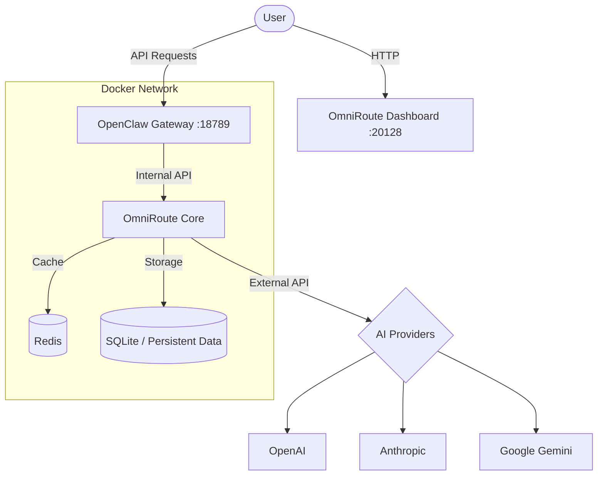

# OmniRoute + OpenClaw (All-in-One Docker)


<div align="center">

[](https://opensource.org/licenses/MIT)
[](https://www.docker.com/)
[](https://github.com/Den3112/OmniRoute-OpenClaw)
[]()

**Professional environment for running OmniRoute and OpenClaw in a unified Docker container.**
*API Aggregator + Agentic AI Gateway — everything you need to work with LLMs in one place.*

[Quick Start](#-quick-start) • [Features](#-features) • [Architecture](#-architecture) • [Services](#-services) • [Documentation](#-documentation)

</div>

---

## 📖 Documentation
- [📥 **Installation Guide**](docs/INSTALL.md)
- [🛠 **Troubleshooting**](docs/TROUBLESHOOTING.md)
- [🏗 **Architecture**](docs/ARCHITECTURE.md)

---

## ✨ Features

### Core Features
- **Unified API Gateway**: Single endpoint for all your AI models (Anthropic, OpenAI, Gemini, etc.).
- **Advanced Load Balancing**: Intelligent routing between multiple providers.
- **Token & Key Management**: Securely manage and rotate your API keys.
- **Real-time Monitoring**: Integrated health checks and performance tracking.
- **Easy Deployment**: Docker-based setup with a one-click installer.
- **Privacy First**: All configurations and logs stay on your server.

### Security Features (NEW! 🔐)
- **Automatic Password Generation**: Unique passwords generated on installation
- **Secret Rotation**: Built-in tool for rotating all security credentials
- **Pre-commit Hooks**: Automatic checks to prevent committing secrets
- **CI/CD Testing**: Automated testing on multiple platforms

### Developer Experience (NEW! 🛠️)
- **Comprehensive Documentation**: Installation guides in English and Russian
- **Troubleshooting Guide**: Solutions for common issues
- **Local Testing**: Test installation before deploying
- **Management Scripts**: Easy-to-use scripts for all operations

---

## 💻 System Requirements
| Component | Minimum | Recommended |
|-----------|---------|-------------|
| CPU | 2 Cores | 4+ Cores |
| RAM | 4 GB | 8 GB+ |
| Disk | 10 GB | 20 GB+ (SSD) |
| OS | Linux / macOS / WSL2 | Ubuntu 22.04+ |

---

## 🚀 Quick Start

### ⚡ One-Command Installation (Recommended)

```bash
curl -fsSL https://raw.githubusercontent.com/Den3112/OmniRoute-OpenClaw/main/install.sh | bash
```

**That's it!** The script will automatically:
- Clone the repository with all submodules
- Generate secure encryption keys
- Build and start all Docker containers
- Verify all services are healthy

### 📦 Manual Installation

```bash
# 1. Clone with submodules
git clone --recursive https://github.com/Den3112/OmniRoute-OpenClaw.git
cd OmniRoute-OpenClaw

# 2. Run automatic installer
./update.sh --yes

# Or interactive mode
./update.sh
```

**What the script does:**
- Initializes and updates all submodules
- Creates `.env` from example and generates secure keys
- Configures permissions and starts Docker containers
- Performs health checks on all services
- Auto-recovers from common issues

---

## 🏗 Architecture

The project uses a microservices architecture, isolated within a private Docker network.

### 📁 Project Structure

```
free-ai-aggregator/
├── data/                      # Persistent data (gitignored)
│   ├── openclaw/             # OpenClaw state and workspace
│   │   ├── workspace/        # Agent workspace
│   │   ├── agents/           # Agent configurations
│   │   └── openclaw.json     # Main config
│   └── omniroute/            # OmniRoute data
│       ├── db/               # SQLite database
│       └── logs/             # Application logs
├── openclaw/                 # OpenClaw source (submodule)
├── OmniRoute/                # OmniRoute source (submodule)
├── scripts/                  # Utility scripts
│   └── check-paths.sh        # Validate project structure
├── monitoring/               # Monitoring stack configs
├── docker-compose.yml        # Main Docker configuration
├── .env                      # Environment variables (gitignored)
├── .env.example              # Environment template
└── README.md                 # This file
```

> **Note:** All data is stored in `./data/` directory, making the project fully portable.
> You can clone this project to any directory and it will work without path modifications.

### 🔄 Service Architecture



---

## 📍 Services

After startup, the following endpoints will be available:

| Service | Address | Credentials |
| :--- | :--- | :--- |
| **OmniRoute Dashboard** | [http://localhost:20128](http://localhost:20128) | Auto-generated during installation |
| **OpenClaw Gateway** | [http://localhost:18789](http://localhost:18789) | Token auto-generated |
| **Redis** | `redis://localhost:6379` | (Internal access) |

> [!IMPORTANT]
> 🔐 **Enhanced Security!** Starting from version 2.0, unique passwords are automatically generated during installation.
> Passwords are displayed at the end of installation. Save them in a secure location!

---

## 🛠 Features

- **🔐 Automatic Security**: The `update.sh` script generates unique encryption keys on first run.
- **🚀 High Performance**: Redis integration provides instant caching of sessions and responses.
- **📊 Smart Logs**: Automatic log rotation (max 10MB per file) protects your disk from overflow.
- **🔄 Easy Updates**: To update both projects to the latest versions, simply run `./scripts/maintenance/update.sh` again.
- **📂 Data Migration**: The script automatically picks up data from old versions (in `$HOME/.omniroute`), if they exist.
- **🏥 Automatic Recovery**: Built-in monitoring and automatic service recovery system.
- **⚡ Zero-config Installation**: One command for complete installation without questions.

---

## 🔧 Management

### Basic Operations

```bash
# Restart all services
./scripts/operations/restart.sh

# Health check and automatic recovery
./scripts/operations/healthcheck.sh

# Status monitoring
./scripts/operations/monitor.sh

# View logs
./scripts/operations/logs.sh

# Full update
./scripts/maintenance/update.sh --yes

# Validate project structure
./scripts/check-paths.sh
```

### Security (NEW! 🔐)

```bash
# Rotate all secrets
./scripts/security/rotate-secrets.sh

# Rotate passwords only
./scripts/security/rotate-secrets.sh --passwords

# Rotate encryption keys only
./scripts/security/rotate-secrets.sh --keys
```

### Backup & Restore

```bash
# Create backup
./scripts/maintenance/backup.sh

# Restore from backup
./scripts/maintenance/restore.sh
```

### Testing

```bash
# Local installation testing
./scripts/install/test-install.sh

# Testing with verbose output
./scripts/install/test-install.sh --verbose

# Testing without cleanup
./scripts/install/test-install.sh --keep
```

---

## ⚙️ Configuration

All settings are stored in the `.env` file. Main variables:

- `STORAGE_ENCRYPTION_KEY`: Key for encrypting data in the database.
- `JWT_SECRET`: Secret for user authorization.
- `OPENCLAW_PASSWORD`: Password for accessing the OpenClaw gateway.
- `INITIAL_PASSWORD`: OmniRoute administrator password on first startup.

---

## 📄 License

This project is distributed under the **MIT** license. See the [LICENSE](LICENSE) file for details.

---

<div align="center">
Created with ❤️ for the AI developer community.
</div>
