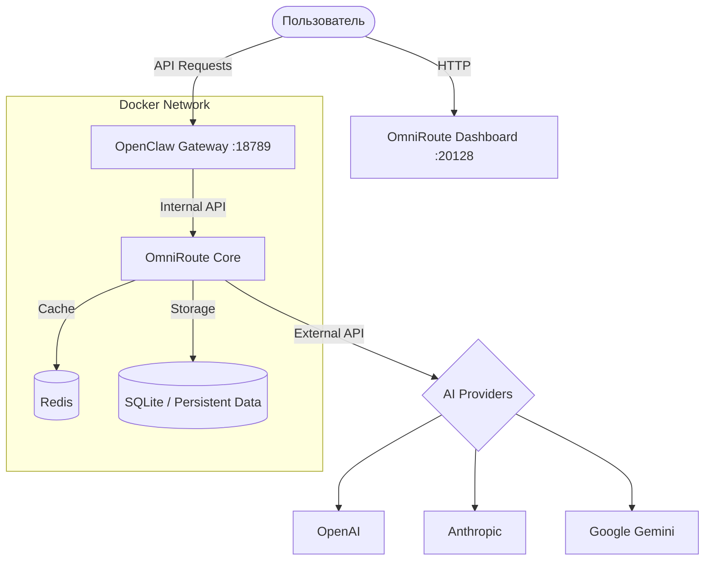

# OmniRoute + OpenClaw (All-in-One Docker)


<div align="center">

[](https://opensource.org/licenses/MIT)
[](https://www.docker.com/)
[](https://github.com/Den3112/OmniRoute-OpenClaw)
[]()

**Профессиональная среда для запуска OmniRoute и OpenClaw в едином Docker-контейнере.**
*Агрегатор API + Agentic AI Gateway — всё, что нужно для работы с LLM в одном месте.*

[Быстрый старт](#-быстрый-старт) • [Особенности](#-особенности) • [Архитектура](#-архитектура) • [Сервисы](#-сервисы) • [Документация](#-документация)

</div>

---

## 📖 Documentation
- [📥 **Installation Guide** (EN)](INSTALL.md)
- [🇷🇺 **Руководство по установке** (RU)](docs/ru/INSTALL.md)
- [🛠 **Troubleshooting**](TROUBLESHOOTING.md)
- [🏗 **Architecture**](ARCHITECTURE.md)

---

## ✨ Features
- **Unified API Gateway**: Single endpoint for all your AI models (Anthropic, OpenAI, Gemini, etc.).
- **Advanced Load Balancing**: Intelligent routing between multiple providers.
- **Token & Key Management**: Securely manage and rotate your API keys.
- **Real-time Monitoring**: Integrated health checks and performance tracking.
- **Easy Deployment**: Docker-based setup with a one-click installer.
- **Privacy First**: All configurations and logs stay on your server.

---

## 💻 System Requirements
| Component | Minimum | Recommended |
|-----------|---------|-------------|
| CPU | 2 Cores | 4+ Cores |
| RAM | 4 GB | 8 GB+ |
| Disk | 10 GB | 20 GB+ (SSD) |
| OS | Linux / macOS / WSL2 | Ubuntu 22.04+ |

---

## 🚀 Quick Start / Быстрый старт

```bash
# 1. Clone with submodules / Клонируйте с подмодулями
git clone --recursive https://github.com/Den3112/OmniRoute-OpenClaw.git
cd OmniRoute-OpenClaw

# 2. Run installer / Запустите установку
chmod +x update.sh
./update.sh
```

**What the script does / Что делает скрипт:**
- Initializes and updates all submodules.
- Creates `.env` from example and generates secure keys.
- Configures permissions and starts Docker containers.
- Performs health checks on all services.

---

## 🏗 Архитектура

Проект использует микросервисную архитектуру, изолированную внутри приватной сети Docker.



---

## 📍 Сервисы

После запуска вам будут доступны следующие адреса:

| Сервис | Адрес | Логин / Пароль (по умолчанию) |
| :--- | :--- | :--- |
| **OmniRoute Dashboard** | [http://localhost:20128](http://localhost:20128) | `admin` / `admin` |
| **OpenClaw Gateway** | [http://localhost:18789](http://localhost:18789) | Токен: `admin` |
| **Redis** | `redis://localhost:6379` | (Внутренний доступ) |

> [!WARNING]
> Сразу после первого входа обязательно смените стандартные пароли в панели управления OmniRoute!

---

## 🛠 Особенности

- **🔐 Автоматическая безопасность**: Скрипт `update.sh` сам генерирует уникальные ключи шифрования при первом запуске.
- **🚀 Высокая производительность**: Интеграция с Redis обеспечивает мгновенное кэширование сессий и ответов.
- **📊 Умные логи**: Автоматическая ротация логов (макс. 10МБ на файл) защищает ваш диск от переполнения.
- **🔄 Легкое обновление**: Для обновления обоих проектов до последних версий достаточно снова запустить `./update.sh`.
- **📂 Миграция данных**: Скрипт автоматически подхватывает данные из старых версий (в `$HOME/.omniroute`), если они существуют.

---

## ⚙️ Конфигурация

Все настройки хранятся в файле `.env`. Основные переменные:

- `STORAGE_ENCRYPTION_KEY`: Ключ для шифрования данных в базе.
- `JWT_SECRET`: Секрет для авторизации пользователей.
- `OPENCLAW_PASSWORD`: Пароль для доступа к шлюзу OpenClaw.
- `INITIAL_PASSWORD`: Пароль администратора OmniRoute при первом запуске.

---

## 📄 Лицензия

Этот проект распространяется под лицензией **MIT**. Подробности в файле [LICENSE](LICENSE).

---

<div align="center">
Создано с ❤️ для сообщества AI разработчиков.
</div>
